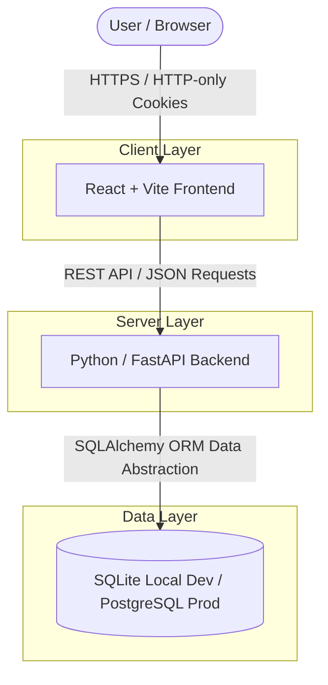

# Routine Tracker MVP Architecture

```mermaid
graph TD
    User([User / Browser]) -->|HTTPS / HTTP-only Cookies| FE[React + Vite Frontend]
    FE -->|REST API / JSON Requests| BE[Python / FastAPI Backend]
    BE -->|SQLAlchemy ORM Data Abstraction| DB[(SQLite Local Dev / PostgreSQL Prod)]

    subgraph Client Layer
        FE
    end

    subgraph Server Layer
        BE
    end

    subgraph Data Layer
        DB
    end
```
